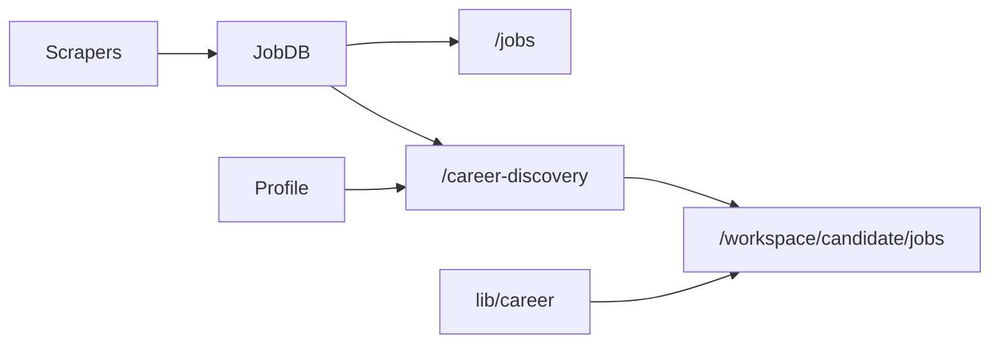

# Career assistant MVP — architecture plan

Brief plan for the career discovery slice: ranked jobs, red-flag heuristics, and match scoring toward **calendar-ready** moments (not inbox noise).

## Reuse (existing TWIN)

| Layer | Reuse |
|-------|--------|
| Data | `Job` model, scrapers (`pracuj`, `rocketjobs`), validation pipeline |
| Matching | `app.matching.matcher.calculate_match_score` via `career_discovery.score` |
| Auth | JWT `get_current_user` on discovery API |
| Assistant | `/career-assistant/*` for ATS CV, interview prep, hiring insights (separate from discovery heuristics) |

## New (this slice)

| Piece | Role |
|-------|------|
| `frontend/src/lib/career/*` | Types, mock/live adapters, client heuristics (red flags, match band) |
| `backend/app/services/career_discovery/*` | Server-side red flags + `score_job_match` for parity with UI |
| `backend/app/api/career_discovery.py` | `POST /career-discovery/red-flags`, `POST /career-discovery/score` |
| `backend/app/schemas/career_discovery.py` | Request/response contracts |

## API surface

- Prefix: `/api/v1/career-discovery`
- `POST /red-flags` — job text + optional skills/salary → structured hits + summary
- `POST /score` — candidate + job dicts → 0–100 score + band (`excellent` \| `good` \| `fair` \| `weak`)

Both routes require authentication (same as candidate workspace).

## Frontend routes (MVP)

| Audience | Route | Purpose |
|----------|-------|---------|
| Candidate | `/workspace/candidate/jobs` | Discovery hub: filters, match badge, red flags, link to listing |
| Recruiter / employer | `/recruiter/employer` (or curated careers) | Posting preview, pool-oriented flows (later: employer scoring) |

Discovery page calls career-discovery API when logged in; falls back to `lib/career` heuristics for mock/offline.

## Data flow

## Out of scope (MVP)

- New scrapers or boards
- LLM red-flag analysis (heuristics only; hiring insights stay on `/career-assistant`)
- Auto-apply from discovery (uses existing applications pipeline)

## Next steps

1. Wire discovery UI to `POST /career-discovery/*` with `X-Locale`.
2. Align bands/copy with `career-discovery-messages` i18n keys.
3. Optional: persist discovery filters as saved searches (client-only MVP OK).
