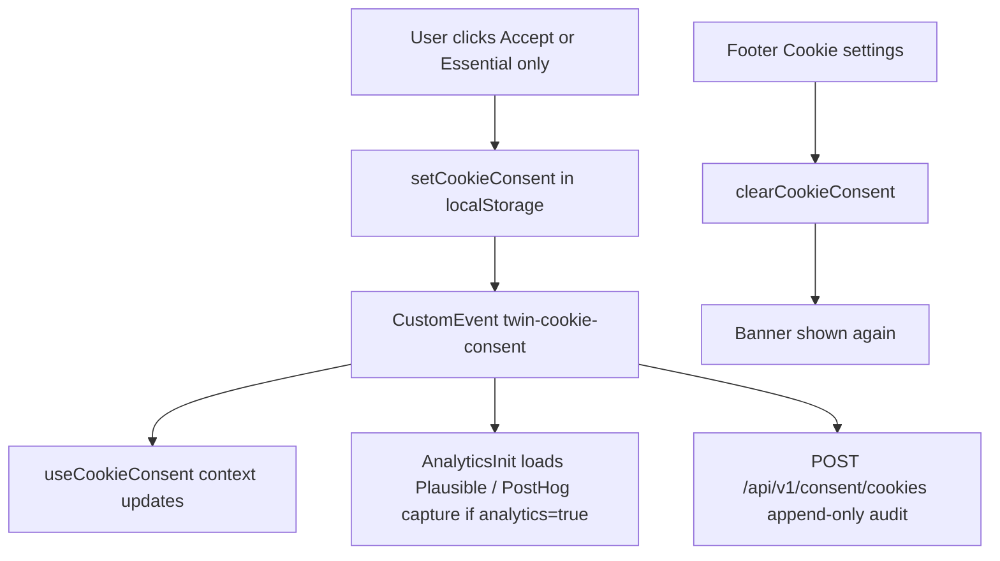

# Cookie consent (browser banner)

TWIN separates **service GDPR** (account signup, CV processing, auto-apply) from **browser cookie / storage consent** (analytics and future marketing pixels).

## What happens on “Accept cookies”



### Accept all

- Persists `twin_cookie_consent_v1` in **localStorage** (via `safeStorage`, with in-memory fallback).
- Sets `analytics: true`, `marketing: true`, `necessary: true`, `version: 1`, `decidedAt` (ISO).
- Initializes **Plausible** (script tag) and allows **PostHog** `/capture/` calls when `NEXT_PUBLIC_POSTHOG_KEY` is set.
- Does **not** enable marketing email opt-in (`users.marketing_emails_opt_in`) — that remains a separate checkbox in register/profile.

### Essential only (reject optional)

- Same storage key with `analytics: false`, `marketing: false`.
- No analytics scripts or events; marketing pixel hook is a no-op.

## Where it is stored

| Layer | Location | Purpose |
|-------|----------|---------|
| Browser | `localStorage["twin_cookie_consent_v1"]` | Source of truth for gating scripts |
| Browser | `localStorage["twin_cookie_visitor_id"]` | Stable anonymous id for server audit hash |
| Server | `cookie_consent_events` (append-only) | GDPR audit trail; `user_id` set when JWT present |

Example JSON:

```json
{
  "version": 1,
  "necessary": true,
  "analytics": true,
  "marketing": false,
  "decidedAt": "2026-05-23T12:00:00.000Z"
}
```

Legacy records with `"v": 1` (no `version` / `necessary`) are still parsed.

## Using consent in product code

```ts
import { analyticsConsentGranted, getCookieConsent } from "@/lib/cookie-consent";
import { useCookieConsent } from "@/components/cookie-consent-provider";

// Imperative (outside React)
if (analyticsConsentGranted()) {
  trackEvent("feature_used", { feature: "calendar_export" });
}

// React
function MyWidget() {
  const { analyticsAllowed, marketingAllowed, hasDecided } = useCookieConsent();
  if (!analyticsAllowed) return null;
  return <UsageChart />;
}
```

Server audit (automatic from `CookieConsentProvider` after each decision):

- `POST /api/v1/consent/cookies` — no auth required; optional `Authorization: Bearer` links `user_id`.

## Integration checklist

- [x] PostHog / Plausible gated on `analytics`
- [x] `initMarketingFromConsent` stub — wire pixels only when `marketing === true`
- [ ] Full PostHog JS SDK (session replay, flags) — still use consent gate before `posthog.init`
- [ ] Map cookie `marketing` to ad pixels when added

## i18n

Copy lives under `cookie.*` in `frontend/src/lib/i18n.ts` (EN + PL).

## Tests

- `npm run test:cookie-consent` — JSON parse unit tests (tsx)
- `pytest backend/tests/test_cookie_consent_api.py` — API append-only row
