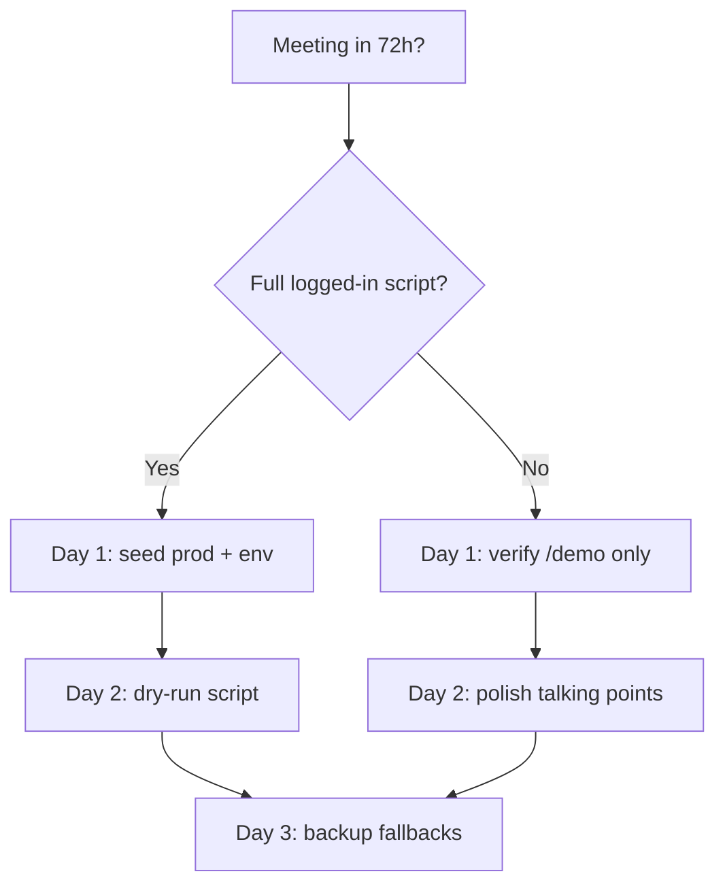

# Demo prep action plan — critical path

**Target:** investor meeting on branch `cursor/phase1-monorepo-scaffold`  
**Audit date:** 2026-05-22  
**Readiness today:** ~90/100 code + infra — **data seed required** for logged-in walkthrough (→ ~95 after seed)  
**Runbook:** [INVESTOR_DEMO_RUNBOOK.md](./INVESTOR_DEMO_RUNBOOK.md)  
**Audit:** [INVESTOR_DEMO_AUDIT_REPORT.md](./INVESTOR_DEMO_AUDIT_REPORT.md)  

---

## Decision tree

---

## Day −3 (today) — unblock data

| # | Task | Owner | Done when |
|---|------|-------|-----------|
| 1 | Confirm Railway API `DATABASE_URL` is **production** (not staging) | Eng | Written confirmation in vault |
| 2 | Set API env: `DEMO_MODE_ENABLED=true`, `DEMO_USER_EMAIL=demo@twin.career` | Eng | `demo_user_configured: true` on snapshot after seed |
| 3 | ☐ Run seed: `export DEMO_USER_PASSWORD='…'` → `railway run python3 scripts/seed-investor-demo.py --reset-password --print-credentials` | **User** | `mvp-stats.total_applications` ≥ 1 |
| 4 | ☐ Store recruiter inbox token from `--print-credentials` | **User** | Token in 1Password / demo sheet |
| 5 | `./scripts/verify-prod-health.sh` | Agent ✅ | All critical flags OK |
| 6 | `./scripts/verify-investor-demo-ready.sh` | Agent ✅ script; **User** after seed | Exit 0 = `live_db` + apps/interviews ≥ 1 |
| 7 | ☐ Login smoke: `demo@twin.career` on https://twin-sooty.vercel.app | **User** | Dashboard shows match % + applied row |

**Exit criteria:** Snapshot `live_db`; dashboard not empty; calendar shows interview.

---

## Day −2 — dry run (full script)

| # | Task | Time | Notes |
|---|------|------|-------|
| 1 | Walk [INVESTOR_DEMO_SCRIPT.md](./INVESTOR_DEMO_SCRIPT.md) steps 0–9 | 35 min | Same JWT throughout |
| 2 | Career assistant: company intel + hiring insights + ATS CV on **applied** row | 10 min | If Claude key missing, note fallback copy |
| 3 | Calendar: prep modal + ICS download (no Google required) | 5 min | |
| 4 | Auto-apply: strip + settings **Run now** (optional) | 5 min | Pracuj only; may be slow—have screenshot backup |
| 5 | Persona → Investor: metrics, placement, data room | 10 min | mvp-stats should show non-zero after seed |
| 6 | Recruiter inbox `?company_slug=nova-hiring-pl` accept/decline | 5 min | Fresh token if expired |
| 7 | Ops proof: `curl -H "Authorization: Bearer $OPS_ADMIN_TOKEN" …/ops/auto-apply/last-run` | 2 min | Screenshot for “autonomous overnight” story |
| 8 | Fix any 404/500; redeploy only if needed | — | Prefer seed fix over code churn |

**Exit criteria:** Zero hard failures on happy path; fallbacks documented for each red step.

---

## Day −1 — polish & contingencies

| # | Task | Notes |
|---|------|-------|
| 1 | `cd backend && pytest tests/test_demo_snapshot.py tests/test_seed_investor_demo.py -q` | Local sanity |
| 2 | `cd frontend && npm run build` | If any UI change landed |
| 3 | `./scripts/railway-alembic-upgrade.sh` | Only if migrations 039–044 not yet on prod |
| 4 | Prepare **offline fallbacks**: static `/demo`, screenshots of dashboard/calendar/investor metrics | USB or second tab |
| 5 | Browser: Chrome profile logged in; disable ad blockers on twin-sooty | |
| 6 | Network: tether backup; API URL bookmarked direct + proxy | |
| 7 | Slide one-liner north star: “calendar of acceptance, not inbox noise” | Align with `.cursorrules` |

**Exit criteria:** Demo sheet printed (password, recruiter URL, ops curl); backups ready.

---

## Day 0 — meeting

| Window | Action |
|--------|--------|
| T−60 min | `verify-prod-health.sh` + `verify-investor-demo-ready.sh` |
| T−30 min | Re-login demo user; open tabs per script order |
| T−5 min | Close Slack/email; Do Not Disturb |
| During | Follow script; skip Stripe/Microsoft if flags false |
| After | Note questions → `docs/NEXT_10_STEPS.md` backlog |

---

## Post-demo (week +1) — not blocking demo

From audit + `NEXT_10_STEPS.md`:

1. Railway secrets: `MICROSOFT_CLIENT_*`, optional `STRIPE_*`  
2. First prod user with auto-apply consent → verify `total_users_processed` ≥ 1  
3. Greenhouse OAuth credentials for live ATS connect click  
4. Dedicated Celery worker service (`docs/RAILWAY_WORKER_PL.md`)  

---

## Environment checklist (no secret values)

| Variable group | Required for demo? | Prod today |
|----------------|-------------------|------------|
| `DATABASE_URL` | Yes (seed) | ✅ reachable |
| `DEMO_MODE_ENABLED`, `DEMO_USER_EMAIL` | Yes | ✅ in `railway-apply-production-env.sh`; `demo_user_configured` true after seed |
| `DEMO_USER_PASSWORD` / seed only | Yes | operator-held |
| `ANTHROPIC_API_KEY` | Recommended | fallbacks exist |
| Google Calendar OAuth | Optional step | ✅ |
| Microsoft Calendar | Optional | ❌ |
| Stripe | No (skipped) | ❌ |
| `GREENHOUSE_*` | Recruiter ATS click | unknown |
| `OPS_ADMIN_TOKEN` | Ops step 9 | ✅ configured |
| Mail `RESEND_*` | Background | ✅ |

Full list: [RAILWAY_PROD_ENV_CHECKLIST.md](./RAILWAY_PROD_ENV_CHECKLIST.md)

---

## Risk register

| Risk | Likelihood | Mitigation |
|------|------------|------------|
| Seed run against wrong DB | Medium | Double-check Railway service + `DATABASE_URL` |
| Snapshot stays static | High if skip Day −3 | Re-seed; verify `DEMO_USER_EMAIL` |
| Claude rate limit / timeout | Low | UI shows deterministic fallback |
| Auto-apply Run now slow/CAPTCHA | Medium | Skip live; show nightly strip + ops last-run |
| Recruiter token revoked | Low | Re-run `--print-credentials` |
| Deploy drift (old git_commit) | Low | health `git_commit` vs branch HEAD before meeting |

---

## Success metrics

| Metric | Target |
|--------|--------|
| Audit score (post-seed) | ≥ 85 |
| `/demo/snapshot` source | `live_db` |
| `mvp-stats.total_applications` | ≥ 1 |
| `mvp-stats.interviews_scheduled` | ≥ 1 |
| Dry-run duration | ≤ 40 min |
| verify-prod-health | all OK |
