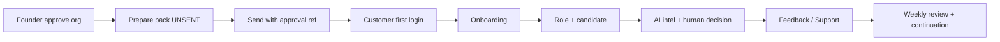

# First Customer Activation — troubleshooting runbook

**Canonical URL:** https://twin-sooty.vercel.app  
**API:** https://twin-production-bcd9.up.railway.app  
**FCS:** `GET /api/v1/admin/pilot-os/first-customer-success`

## Quick status

```bash
python scripts/controlled-pilot-os-status.py
# or with token:
OPS_ADMIN_TOKEN=… python scripts/controlled-pilot-os-status.py
# First Customer Success plane:
curl -s -H "Authorization: Bearer $OPS_ADMIN_TOKEN" \
  "$API/api/v1/admin/pilot-os/first-customer-success" | jq .verdict,.kpi
```

| Symptom | Check | Fix |
|---------|-------|-----|
| Verdict AWAITING ORG | approved_real_orgs=0 | Founder complete intake + FOUNDER_APPROVE (non-synthetic) |
| Send blocked | send-safety blockers | Org approved, pack READY_UNSENT, recipients, send ref ≥8, enrollment OFF |
| Register 403 | Invite-only on | Add email to `PILOT_EMAIL_ALLOWLIST` (ops) after Founder approve |
| Blank login | FE tip / CORS | Confirm sooty 200; CORS includes sooty |
| Inbox empty | Recruiter token / company slug | Recruiter session smoke; sync token hash |
| AI scores 0 | No real activity | Expected; synthetic ≠ real |
| Support unanswered | `/admin/pilot-os` tickets | Assign + resolve within SLA |
| KPI still NO_REAL | No approved org / no activation | Expected until FOUNDER_APPROVE + SENT + login |
| twin.care lander | Afternic NS | Use sooty; DNS runbook non-blocking |
| Provisioning | dry-run only | Never provision real tenant without approval |

## Release notes (first customer success)

- Service `first_customer_success.py` + Pilot OS panel  
- Alembic still `104_ai_intel_validation` (no new migration for FCS)  
- Pack prepare embeds bilingual FCS subjects + AI section  
- Phase 2: handoff doc only — `docs/PHASE2_PRODUCTION_HARDENING_HANDOFF.md`  
- Launch GO readiness score ≠ Launch GO decision (stays NO-GO)

## Diagram (ops flow)


