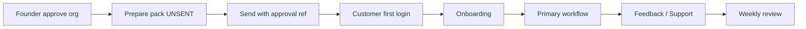

# First Customer Activation — troubleshooting runbook

**Canonical URL:** https://twin-sooty.vercel.app  
**API:** https://twin-production-bcd9.up.railway.app

## Quick status

```bash
python scripts/controlled-pilot-os-status.py
# or with token:
OPS_ADMIN_TOKEN=… python scripts/controlled-pilot-os-status.py
```

| Symptom | Check | Fix |
|---------|-------|-----|
| Register 403 | Invite-only on | Add email to `PILOT_EMAIL_ALLOWLIST` (ops) after Founder approve |
| Blank login | FE tip / CORS | Confirm sooty 200; CORS includes sooty |
| Inbox empty | Recruiter token / company slug | Recruiter session smoke; sync token hash |
| Support unanswered | `/admin/pilot-os` tickets | Assign + resolve within SLA |
| KPI still NO_REAL | No approved org | Expected until FOUNDER_APPROVE + SENT pack |
| twin.care lander | Afternic NS | Use sooty; DNS runbook non-blocking |

## Release notes (first customer)

- Alembic `101_first_customer_activation` — feedback queue + support SLA  
- Admin `/admin/pilot-os` — health / Launch GO readiness scores  
- Feedback types: bug / suggestion / NPS / contact  
- Launch GO readiness score ≠ Launch GO decision (stays NO-GO)

## Diagram (ops flow)


