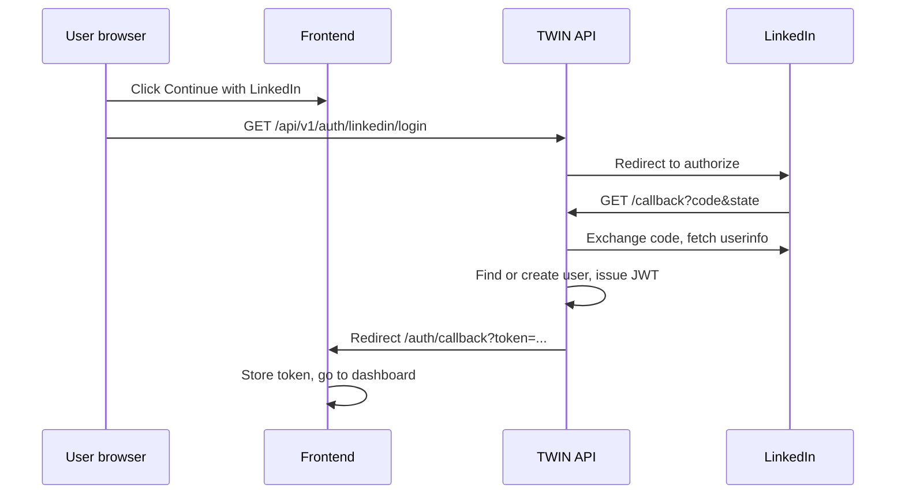

# LinkedIn OAuth sign-in

TWIN uses LinkedIn’s **Sign In with LinkedIn using OpenID Connect** product. Users click “Continue with LinkedIn” on login/register; the API exchanges the code for profile + email, creates or links a user, and redirects to the frontend with a JWT.

## 1. Create a LinkedIn Developer app

1. Open [LinkedIn Developer Portal](https://www.linkedin.com/developers/apps) and create an app (or use an existing one).
2. Under **Products**, request **Sign In with LinkedIn using OpenID Connect**.
3. Under **Auth** → **OAuth 2.0 settings**:
   - Add **Authorized redirect URLs** (must match `LINKEDIN_REDIRECT_URI` exactly):
     - Local: `http://localhost:8000/api/v1/auth/linkedin/callback`
     - Production: `https://<your-api-host>/api/v1/auth/linkedin/callback`
4. Copy **Client ID** and **Client Secret** from the **Auth** tab.

## 2. Environment variables

Set these on the **API** service (see `.env.example`):

| Variable | Description |
|----------|-------------|
| `LINKEDIN_CLIENT_ID` | OAuth client ID |
| `LINKEDIN_CLIENT_SECRET` | OAuth client secret |
| `LINKEDIN_REDIRECT_URI` | Callback URL registered in LinkedIn (default: local API callback above) |
| `FRONTEND_URL` | Where users land after OAuth (default: `http://localhost:3000`) |

Also ensure:

- `SECRET_KEY` — used for JWTs and OAuth `state` tokens
- `CORS_ORIGINS` — includes your frontend origin

The frontend only needs `NEXT_PUBLIC_API_URL` pointing at the API (login button links to `{API_URL}/api/v1/auth/linkedin/login`).

## 3. Database migration

Run migration `003_linkedin_oauth` (adds `users.linkedin_id`, makes `hashed_password` nullable):

```bash
cd backend && alembic upgrade head
```

## 4. Flow



## 5. Account linking

- New LinkedIn users get an account with email from LinkedIn and no password.
- If the same email already exists (email/password signup), the provider is linked on first OAuth login (`oauth_accounts` row; LinkedIn also sets `users.linkedin_id` for backward compatibility).
- Email/password login still works for users who set a password; OAuth-only users must use a linked provider.

## 6. Troubleshooting

| Symptom | Check |
|---------|--------|
| 503 on `/linkedin/login` | `LINKEDIN_CLIENT_ID` and `LINKEDIN_CLIENT_SECRET` set |
| `redirect_uri` mismatch | `LINKEDIN_REDIRECT_URI` matches LinkedIn app settings exactly |
| Missing email | OpenID Connect product enabled; scopes include `openid profile email` |
| CORS errors | `CORS_ORIGINS` includes frontend URL; OAuth redirects are server-side (no CORS on callback) |

## 7. Production checklist

- [ ] HTTPS on API and frontend
- [ ] Production redirect URI added in LinkedIn app
- [ ] `FRONTEND_URL` set to production app URL
- [ ] Secrets stored in platform env (Railway/Render), not committed

## 8. Other OAuth providers (Google, GitHub, Apple)

Same server-side redirect flow: `GET /api/v1/auth/{google|github|apple}/login` → provider → callback on the API → JWT → `FRONTEND_URL/auth/callback?token=…`.

- **Status (all providers):** `GET /api/v1/auth/oauth/status` returns `{ linkedin, google, github, apple }`.
- **Redirect URIs** (must match the corresponding `*_REDIRECT_URI` env var exactly):

| Provider | Example redirect URL |
|----------|----------------------|
| Google | `https://<api>/api/v1/auth/google/callback` |
| GitHub | `https://<api>/api/v1/auth/github/callback` |
| Apple | `https://<api>/api/v1/auth/apple/callback` (web uses `response_mode=form_post`; callback is **POST**) |

Account linking uses the `oauth_accounts` table (migration `005_oauth_accounts`). Same email across providers maps to one user; `gdpr_consent_at` is set when linking or creating via OAuth.

Environment variables: see `/.env.example` (`GOOGLE_*`, `GITHUB_*`, `APPLE_*`).
