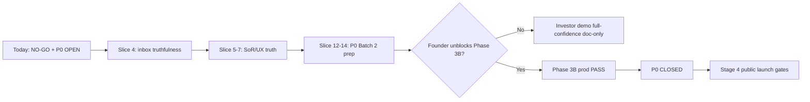

# TWIN Public Launch Readiness Plan — 2026-06-27

**Purpose:** Founder/operator roadmap from current scaffold to **full-confidence** investor demo and eventual public launch. Evidence-only; **no runtime activation** in this batch unless explicitly noted in a slice.

**Branch at capture:** `cursor/phase1-monorepo-scaffold` → `86c8c1b` (post PR #313)  
**Plan PR branch:** `launch/full-confidence-plan-2026-06-27`

**Canonical references:**
- [TWIN_FEATURE_STATUS_AUDIT_2026-06-27.md](./TWIN_FEATURE_STATUS_AUDIT_2026-06-27.md)
- [TWIN_FULL_APPLICATION_AUDIT_2026-06-27.md](./TWIN_FULL_APPLICATION_AUDIT_2026-06-27.md) (PR #314 — OPEN)
- [P0_PERFORMANCE_INVENTORY_2026-06-27.md](./P0_PERFORMANCE_INVENTORY_2026-06-27.md)
- [TWIN_OPERATING_CONTEXT_2026-06-26.md](./TWIN_OPERATING_CONTEXT_2026-06-26.md)
- [HIRING_JOURNEY_TRACEABILITY_2026-06-26.md](./HIRING_JOURNEY_TRACEABILITY_2026-06-26.md)
- [PUBLIC_LAUNCH_GATE_CHECKLIST_2026-05-27.md](./PUBLIC_LAUNCH_GATE_CHECKLIST_2026-05-27.md)

---

## 1. Executive Summary

| Decision | Stance |
|----------|--------|
| **Public launch** | **NO-GO** — no LinkedIn/X/PressOn, no uncontrolled signup spike, no “we’re live” marketing |
| **Controlled investor demo** | **YES** — with explicit boundaries (read-only previews, pilot badges, no live workflow claims) |
| **Controlled recruiter pilot** | **GO with constraints** — H5b PASS; H5c/H5d **HOLD**; external invites **0** |
| **P0 performance** | **OPEN** — Phase 3B **HARD BLOCKED** (founder STOP) |
| **Auto-apply / delegated apply** | **PAUSED / NOT LIVE** |
| **Code constant** | `LAUNCH_STANCE = "noGo"` in `frontend/src/lib/investor-metrics-reality.ts` |

**North star (unchanged):** Calendar of acceptance — pre-qualified interview slots, not inbox spam. Every slice must reduce noise toward acceptance-ready calendar items or document honest boundaries.

**This plan:** Documents the path to full-confidence demo and launch gates. Slice 4 (this PR) includes recruiter inbox duplicate module collapse (frontend-only truthfulness fix).

---

## 2. Current Baseline Snapshot

| Field | Value |
|-------|-------|
| **repo_head** | `86c8c1b219996d986d2f340e7b37b3f33e04a448` (`86c8c1b`) |
| **prod_frontend_commit** | `86c8c1b219996d986d2f340e7b37b3f33e04a448` |
| **prod_api_commit** | `6d6d1e54f85f8f00fe1727f32cef700e9c2a20aa` (`6d6d1e5`) |
| **alignment_status** | **frontend aligned**; API drift **expected** (frontend-only #309–#313) |
| **docs_only_drift** | false — prod FE caught up to scaffold |
| **public-health** | `status=ok`, `db_ok=true` (curl 2026-06-27) |
| **validated_jobs** | 652 |
| **microsoft_calendar_write_enabled** | false |
| **scrape_beat_enabled** | true |
| **stripe_checkout_ready** | true |

### Open PRs

| PR | Title | State | Notes |
|----|-------|-------|-------|
| [#314](https://github.com/CzechowskiT/twin/pull/314) | docs: add full application audit (2026-06-27) | **OPEN** | Docs-only; MERGEABLE; Vercel SUCCESS; 25-section board audit — merge after review, does not change launch stance |

### Navigation truth layers (post #312–#313)

| Layer | Count | Source |
|-------|-------|--------|
| SoR registry | 83 entries | `system-of-record-routes.ts` (+4 reconciled in #312) |
| Candidate workspace | 12 cards | `candidate-workspace-modules.ts` |
| Recruiter workspace | 12 cards (post Slice 4 collapse) | `recruiter-workspace-modules.ts` |
| Company workspace | 9 cards | `company-workspace-modules.ts` |
| Investor workspace | 6 + 2 public preview | `investor-workspace-modules.ts` |

---

## 3. Last 3 Weeks Change Log by Capability

PRs **#309–#314** on `cursor/phase1-monorepo-scaffold` (2026-06-27 batch).

| PR | Capability area | What shipped | Launch impact |
|----|-----------------|--------------|---------------|
| **#309** | Auth / landing | Reconcile landing auth-shell login fix for stale JWT — header bars, `auth.ts` | Fixes expired-session login entry; no auth weakening |
| **#310** | Auth / e2e | Harden `landing-auth-shell-browser` for stale JWT hydration | Test-only hardening; browser gated |
| **#311** | Docs / inventory | `TWIN_FEATURE_STATUS_AUDIT_2026-06-27.md` — module classification, SoR drift | Docs-only; surfaces MISLEADING_OR_RISKY cards |
| **#312** | SoR / navigation | Reconcile SoR entries: `recruiter_pipeline`, `recruiter_calendar`, `company_pipeline`, `candidate_career_compass` | QA guards now cover workspace-only routes |
| **#313** | SoR / company UX | `hintKey` on all company **live** SoR modules (tenant/token scope) | Reduces live-badge over-read |
| **#314** | Docs / audit | Full application audit (25 sections) — OPEN | Evidence appendix; no runtime |
| **This PR** | Recruiter UX truthfulness | Collapse duplicate inbox module cards (`notes_scorecards`, `scheduling`, `audit`) | Removes MISLEADING_OR_RISKY duplicate CTAs |

**Prior context (#287–#308):** Hiring Journey (#291–#298), operating context (#299–#303), P0 inventory (#304), route-weight Batch 1 (#305), landing auth (#306–#308).

---

## 4. Demo Readiness Matrix

| Area | Demo-ready? | Boundaries | Evidence |
|------|-------------|------------|----------|
| **Homepage + `/demo`** | ✅ | Interactive simulation; no live apply | `test:homepage-nav`, `test:interactive-demo` |
| **Candidate dashboard** | ✅ partial | Auto-apply **paused**; offers/matches distinct pages | Feature audit § Candidate |
| **Candidate trust center** | ✅ pilot | 11 SoR routes; human_decision_required | SoR + trust guards |
| **Candidate calendar** | ✅ read-only | Google OAuth read; no recruiter sync | Calendar docs |
| **Recruiter inbox** | ✅ pilot | Token auth; accept/decline; H5b PASS; no email send | Production-smoked |
| **Recruiter pipeline** | ✅ live | ATS-lite; manual scheduling in inbox context | Workspace + SoR |
| **Recruiter calendar** | ❌ | **NOT LIVE** — explicit badge | `not_live` in WS + SoR |
| **Recruiter talent radar** | ✅ pilot | `no_outreach` | Boundary tags |
| **Company roles/pipeline** | ✅ partial | Token hints on live SoR (#313) | persona-dashboard test |
| **Company billing** | ❌ | **not_live** | Honest badge |
| **Hiring Journey (5 routes)** | ✅ preview | Read-only; no workflow engine | 25/25 tests |
| **Scheduling proposal pack** | ✅ preview | Blocked calendar/invite/email | scheduling-proposal tests |
| **Investor room + metrics** | ✅ read-only | `LAUNCH_STANCE=noGo` marker | investor-room-mvp |
| **Board readiness monitors** | ✅ internal | Pilot + not_live tags; not product modules | 13 board routes |
| **Placement verification** | ✅ preview | Self-serve state machine; no CS tennis | PLACEMENT_VERIFICATION.md |
| **Auto-apply** | ❌ | **PAUSED** — must stay paused in demo | Safety audit |
| **Microsoft calendar** | ❌ | Busy-read/write gates false in prod health | Scope audit |
| **Phase 3B multitab** | ❌ | **HARD BLOCKED** — do not run | Founder STOP |

---

## 5. Public Launch Gate Matrix

Condensed from [PUBLIC_LAUNCH_GATE_CHECKLIST_2026-05-27.md](./PUBLIC_LAUNCH_GATE_CHECKLIST_2026-05-27.md). **Overall: NO-GO.**

| Category | Green | Partial / Hold | Blocking for public launch |
|----------|-------|----------------|----------------------------|
| **Security (S1–S11)** | S1–S7, S9–S11 | — | All must stay green |
| **Operational (O1–O10)** | O1–O4, O7–O9 | O5 calendar waiver, O6/O10 Vercel drift | O5 waiver OK for pilot only |
| **Legal (L1–L7)** | L1–L5, L7 | L6 self-service delete | L6 manual DSR OK for pilot |
| **Pilot (P1–P7)** | P1–P6 | P7 H5c/H5d HOLD | External invites blocked |
| **P0 performance** | — | **OPEN** | **Launch-blocking** |
| **Phase 3B** | — | **HARD BLOCKED** | **Launch-blocking** |
| **Product truthfulness** | Improved (#312–#313, Slice 4) | Investor SoR overload, company pipeline status skew | Demo risk, not security |

**Pilot/demo GO does not imply public launch GO.**

---

## 6. Full-Confidence Demo Standard

A demo meets **full-confidence** when ALL of the following hold:

1. **Honest badges** — Every shown module has correct `live` / `pilot` / `not_live` / `paused` status; boundary tags visible on SoR hub where applicable.
2. **No duplicate module fiction** — No separate cards routing to the same URL without explicit “same page” hint (Slice 4 addresses recruiter inbox).
3. **No affirmative live-action copy** — Hiring Journey, scheduling proposal, trust surfaces pass forbidden-copy guards (#296).
4. **Founder script boundaries** — Demo stays within §16 script; no calendar sync, email send, ATS write, auto-apply, or outreach claims.
5. **Auth clarity** — Stale JWT shows login ( #309); recruiter inbox uses token/slug auth as documented.
6. **Performance honesty** — Do not claim multitab or Lighthouse closure; acknowledge P0 OPEN if asked.
7. **Investor metrics** — `/investor/metrics` shows reality dashboard with `investor-launch-stance-no-go` marker.
8. **Static guard PASS** — Full verification batch (§13) green on deploy SHA.

---

## 7. Product Truthfulness Backlog

| ID | Issue | Severity | Fix slice |
|----|-------|----------|-----------|
| T1 | Recruiter duplicate inbox cards (notes/scheduling/audit) | P1 | **Slice 4 (this PR)** — collapse |
| T2 | Company workspace `pipeline` **live** vs SoR demo pipeline **pilot** | P2 | **Slice 6 (this PR)** — hint + demo/live copy |
| T3 | Investor SoR overload (19 entries mix product/board/demo) | P2 | Slice 8 — hub grouping |
| T4 | Candidate trust (11 routes) not in workspace grid | P2 | **Slice 7 (this PR)** — discoverability link |
| T5 | Company `settings` orphan → dashboard | P3 | **Slice 9 (this PR)** — removed orphan card |
| T6 | Investor `investor_product_proof` **live** with heavy boundaries | P2 | **Slice 10 (this PR)** — copy/badge tighten |
| T7 | Board 7 monitor routes without SoR cards | P3 | Document only (intentional) |
| T8 | Landing/marketing copy vs prod reality | P2 | Slice 11 — trust-language sweep |

---

## 8. Functional Completeness Backlog

| Capability | Shipped | Gap to launch |
|------------|---------|---------------|
| Job discovery + matching | ✅ scrape + match | Market coverage 6%; quality gates |
| Recruiter accept/decline | ✅ inbox API | External cohort HOLD; no calendar write |
| Manual scheduling | ✅ inbox-only | No `/recruiter/scheduling` page; no email |
| Calendar OAuth (Google) | ✅ candidate read | Recruiter sync NOT LIVE; Microsoft gates false |
| Auto-apply | ⏸ PAUSED | Consent + ops gates; public path blocked |
| Delegated apply | ❌ NOT LIVE | Hard-gated in backend |
| ATS sync | ❌ | `no_ats_sync` on integrations |
| Placement verification | ✅ preview | Invoice automation not live |
| Microsoft Graph busy-read | ❌ | Staging only |
| Self-service DSR delete | ⚠️ partial | Manual workflow per L6 waiver |
| Workflow engine (Hiring Journey) | ❌ | Preview-only; 11 demo steps |
| Phase 3B multitab perf | ❌ | Blocked |

---

## 9. Safety / Workflow Activation Plan (Stages 0–4)

**Document only — no implementation in this plan.** Activation requires founder GO per stage.

| Stage | Name | What’s allowed | What stays blocked |
|-------|------|----------------|-------------------|
| **0** | **Current (demo/pilot)** | Read-only previews; recruiter inbox accept/decline in named pilot; copy-to-clipboard scheduling; Google calendar read (candidate) | Auto-apply, delegated apply, email send, calendar write, ATS sync, outreach, Phase 3B, public signup spike |
| **1** | **Expanded pilot** | H5c/H5d slot-1 external recruiter (explicit GO SMALL 1/2); authenticated persistence smoke on pilot cohort | Nightly auto-apply beat; platform trigger-sweep for non-ops; Microsoft write |
| **2** | **Calendar propose (human-in-loop)** | Scheduling proposal pack → manual founder-approved calendar holds; ICS export/WebCal subscribe | Automatic invite send; Graph write without gate review |
| **3** | **Controlled automation** | Auto-apply for verified-ready candidates on allowlisted boards; Celery beat re-enabled with caps | Public launch marketing; unbounded scrape; delegated apply |
| **4** | **Public launch** | All gates in §5 green; P0 CLOSED; Phase 3B proof; self-service DSR; Lighthouse budgets signed | — |

**Hard rule:** Never skip stages. Stage N+1 requires written founder decision + gate evidence row.

---

## 10. P0 / Performance Closure Plan

**Status: OPEN.** See [P0_PERFORMANCE_INVENTORY_2026-06-27.md](./P0_PERFORMANCE_INVENTORY_2026-06-27.md).

| Batch | Scope | Status |
|-------|-------|--------|
| Batch 1 | Static guards + hiring-journey route-weight (#304–#305) | ✅ Done |
| Batch 2 | Shell fix + Phase 3B browser | ❌ **Blocked** — founder STOP |
| Batch 3 | Prod sequential smokes (31-route + hiring-journey browser) | ❌ Gated — Playwright default OFF |
| Batch 4 | Lighthouse budgets + manual 8–12 tab Chrome (RSS) | ❌ Not started |

**Closure criteria:** Phase 3B 21/21 prod PASS + p0-no-headless-final-state prod PASS + manual multitab RSS within budget + signed Lighthouse numbers.

---

## 11. Security / Privacy / Compliance Launch Plan

| Workstream | Current | Pre-launch action |
|------------|---------|-------------------|
| CSP enforce | ✅ LIVE (S2 PASS) | Monitor; no regression |
| Rate limits | ✅ Layer 2 on mutations | Re-verify SHA on deploy |
| Stripe webhook dedup | ✅ migration 050 | Confirm prod Alembic head |
| GDPR consent | ✅ signup + auto-apply consent | — |
| Cookie consent | ✅ PL + EN | — |
| DSR export | ✅ JSON/CSV/XLSX | Self-service delete (L6) |
| Placement verification | ✅ self-serve design | No CS tennis default |
| Scraping compliance | ✅ pracuj.pl / rocketjobs.pl terms | — |
| Secrets scan | ✅ baseline | Re-run before launch |
| Dependency audit | ✅ baseline | Re-run before launch |
| PII in logs | Guarded | Audit on new endpoints |

---

## 12. Observability / Ops Launch Plan

| Surface | Purpose | Launch requirement |
|---------|---------|-------------------|
| `/api/public-health` | Deploy SHA + feature flags | Frozen by regression tests |
| `/status` | Public status page | Smoke green |
| Celery health | Worker active | O3 green |
| Board persistence monitor | Cross-persona ops | Internal only |
| Audit events API | Append-only trail | Prod persistence smoke |
| Launch-day runbook | T-60/T-30/T-15 | `LAUNCH_DAY_MONITORING_ROLLBACK_RUNBOOK` |
| Incident response | Named on-call | O8 green |
| Backup/restore drill | Postgres | O7 PASS — re-drill before launch |
| CI smoke workflow | Last 5 commits | O1 green |
| Playwright prod smoke | Browser gates | Explicit env flags only; not in default CI |

---

## 13. Test Gate Plan

**Required static batch (every frontend PR on scaffold):**

```bash
cd frontend
npm run test:persona-dashboard-navigation
npm run test:system-of-record-navigation-hub
npm run test:hiring-journey
npm run test:p0-route-weight-inventory
npm run test:p0-performance-guardrails
npm run test:landing-auth-shell
npm run test:i18n-native-copy-quality
npm run test:i18n-coverage
npm run test:trust-language-guard
npm run build && npx tsc --noEmit
```

**Gated (explicit env only — NOT default CI):**

- `test:phase3b-controlled-multitab-browser` — **FORBIDDEN** until founder unblock
- `test:p0-no-headless-final-state-browser` — post-deploy manual
- `test:hiring-journey-browser` — optional post-deploy
- `test:e2e` — DISABLED (CPU storm 2026-06-16)

**Backend (separate lane):** `pytest` on API changes — not in this frontend-only batch.

---

## 14. Roadmap to Full Confidence



**Timeline (indicative, founder-dependent):**

1. **Week 1:** Slices 4–7 (truthfulness + SoR polish) — demo confidence ↑
2. **Week 2–3:** P0 shell fix review + Batch 2 prep (no browser until unblock)
3. **Week 4+:** Phase 3B prod proof → P0 closure → launch gate audit

---

## 15. First 20 Implementation Slices

| # | Slice | Scope | Files / tests | Safety |
|---|-------|-------|---------------|--------|
| 1 | Feature status audit doc | Docs | `TWIN_FEATURE_STATUS_AUDIT` | ✅ #311 |
| 2 | SoR registry reconcile | FE | `system-of-record-routes.ts` | ✅ #312 |
| 3 | Company SoR token hints | FE | SoR + i18n | ✅ #313 |
| 4 | **Recruiter inbox duplicate collapse** | FE | `recruiter-workspace-modules.ts`, nav tests | **This PR** |
| 5 | Launch readiness plan doc | Docs | This file | **This PR** |
| 6 | Company pipeline status align | FE | WS vs SoR status skew | Frontend-only |
| 7 | Candidate trust hub link | FE | Dashboard quick link to trust SoR | Read-only |
| 8 | Investor SoR hub grouping | FE | Group board vs product in hub UI | Copy-only | ✅ Slice 8 |
| 9 | Company settings card fix | FE | Remove orphan or honest redirect | UX | ✅ Slice 9 |
| 10 | Investor product proof badge | FE | Tighten live + boundary display | Copy | ✅ Slice 10 |
| 11 | Marketing copy trust sweep | FE/docs | homepage, `/demo`, FAQ | No live claims | ✅ Slice 11 |
| 12 | P0 shell fix (founder review) | FE | `LightweightRouteShell` | **Blocked** |
| 13 | Hiring journey → p0-no-headless list | FE/tests | Add 5 routes to 36-route spec | ✅ Slice 13 — gated browser |
| 14 | Investor room i18n parity | FE/tests | `/investor`, product proof, SoR groups EN/PL | ✅ Slice 14 — copy-only |
| 15 | Public nav investor entrypoint | FE | Header persona lane → `/investor` | ✅ Slice 15 — copy-only |
| 16 | Phase 3B static guard refresh | FE/tests | Post-shell route batch | **Blocked** |
| 17 | Lighthouse budget definition | Docs | Signed numbers doc | Post-3B |
| 18 | Microsoft busy-read staging smoke | FE/API | Staging only | Gates false in prod |
| 19 | Self-service DSR delete MVP | BE/FE | L6 closure | Privacy review |
| 20 | H5c slot-1 external recruiter | Ops/docs | Pilot pack execution | Founder GO only |
| 21 | Auto-apply Stage 3 prep | BE | Allowlist + caps design | No activation |
| 22 | Public launch gate re-audit | Docs | Refresh checklist at P0 CLOSED | Founder sign-off |

### Slice 4 detail (this PR)

**Problem:** Recruiter workspace showed three separate module cards (`notes_scorecards`, `scheduling`, `audit`) all linking to `/recruiter/inbox` — classified **MISLEADING_OR_RISKY** in feature audit.

**Approach:** **Collapse** — remove the three duplicate cards; capabilities remain accessible inside inbox (notes in review cards, scheduling via prepare-invite panel, audit via decision events).

**Non-goals:** No new routes, no backend changes, no inbox UI changes, no live-action activation.

### Slice 8 detail

**Problem:** Investor SoR hub listed 19 flat cards mixing product surfaces, `/board/*` readiness evidence, and demo proof deep-links — hard to scan during diligence.

**Approach:** **Group** — `investorGroup` field on investor SoR entries; hub renders four optional sections (`investorProduct`, `boardEvidence`, `demoProof`, `accessContact`) with EN/PL headings and boundary intro copy (read-only board, demo no writeback).

**Non-goals:** No route removal, no non-investor hub changes, no backend/API/live-action.

### Slice 9 detail

**Problem:** Company workspace showed a `settings` module card (`needs_setup`) linking to `/company/dashboard` — duplicate of SoR `company_dashboard` without honest “same page” hint.

**Approach:** **Remove orphan** — dashboard remains the sole entry via SoR hub on company dashboard; no `/company/settings` route.

**Non-goals:** No backend/API/auth/workflow, no new settings surface, no company SoR registry changes.

### Slice 10 detail

**Problem:** Investor SoR `investor_product_proof` is **live** with `human_decision_required`, `no_outreach`, `no_ats_sync` boundaries — easy to over-read as a production workflow during diligence.

**Approach:** **Option A — keep live, strengthen copy** — add `hintKey` on the SoR card, tighten `demoJourneyDesc` and investor product group lead (bounded proof, no launch/outreach/ATS writeback claims).

**Non-goals:** No status downgrade to pilot, no route removal, no backend/API/live-action, no investor grouping relabel.

### Slice 11 detail

**Problem:** Homepage, `/how-it-works`, `/demo`, FAQ, and onboarding still implied live auto-apply, calendar sync/writes, or “while you sleep” automation inconsistent with launch stance (auto-apply **PAUSED**, Microsoft calendar writes **OFF**, public **NO-GO**).

**Approach:** **Copy-only trust sweep** — tighten EN+PL i18n and FAQ to prepare-only / phased / human-decision language; extend `trust-language-guard` and `i18n-native-copy-quality` with EN/PL marketing-domain guards (positive-claim detection allows negative context: “no ATS writeback”, “NO-GO”, “human review”).

**Non-goals:** No LAUNCH_STANCE change, no route/auth/feature-flag/backend changes, no Phase 3B.

### Slice 14 detail

**Problem:** Investor room (`/investor`, `/for-investors`), executive product proof, and investor SoR group headings had EN/PL parity gaps — English loanwords and missing `demoMapProductProof` overlay keys for non-EN locales.

**Approach:** **Copy-only i18n parity** — localize PL investor room + product proof labels; align SoR group leads with bounded-diligence boundaries; add overlay `demoMapProductProof` for es/it/fr/de/zh/ar/ja; extend static guards.

**Non-goals:** No shell, no Phase 3B, no browser smoke, no launch/ATS/outreach claims, no LAUNCH_STANCE change.

## 16. Investor Demo Script Boundaries

**DO show:**

- Homepage → `/demo` interactive walkthrough
- Candidate: profile, matches, jobs, trust preview, hiring journey (read-only badge)
- Recruiter: inbox accept/decline (demo token), pipeline stages, search, talent radar (no outreach copy)
- Company: roles, pipeline (mention token scope), hiring journey
- Investor: `/investor`, metrics reality dashboard, roadmap, placement preview
- Board (if technical audience): working-features-readiness, audit-event-foundation

**DO NOT show or claim:**

- “We apply while you sleep” (auto-apply paused)
- Recruiter calendar sync / automatic scheduling / email sent
- ATS live sync or outbound sourcing
- Microsoft calendar write or busy-read in prod
- Phase 3B multitab performance proof
- Public launch GO or “production-ready for everyone”
- H5c/H5d external cohort unless explicit founder GO SMALL

**If asked about gaps:** Point to `LAUNCH_STANCE=noGo`, P0 OPEN, and staged activation plan (§9).

---

## 17. Decision Log / Founder Decisions

| Date | Decision | Status |
|------|----------|--------|
| 2026-06-17 | Phase 3B multitab — **STOP** until shell fix | **ACTIVE BLOCK** |
| 2026-06-07 | Public launch **NO-GO**; pilot/demo GO | **ACTIVE** |
| 2026-06-07 | H5c/H5d external recruiter invites **HOLD** | **ACTIVE** |
| 2026-06-03 | L6 DSR + O5 calendar **partial waivers** for pilot | **ACTIVE** |
| 2026-06-16 | Playwright default CI **DISABLED** (CPU storm) | **ACTIVE** |
| 2026-06-27 | SoR reconcile + company hints (#312–#313) | **SHIPPED** |
| 2026-06-27 | Recruiter inbox duplicate collapse (Slice 4) | **THIS PR** |
| TBD | Phase 3B unblock | **PENDING founder** |
| TBD | H5c slot-1 GO SMALL 1/2 | **PENDING founder** |
| TBD | Public launch GO | **BLOCKED** — §5 not green |

---

## 18. Final Recommendation

1. **Do not public launch.** Gates in §5 remain red on P0 and Phase 3B; product truthfulness still has backlog items (§7).
2. **Proceed with controlled investor demo** using §16 boundaries — current prod at `86c8c1b` is suitable with founder present.
3. **Merge PR #314** (full application audit) after review — complements this plan; still docs-only.
4. **Ship Slice 4** (inbox collapse) + this plan — highest ROI truthfulness fix with minimal risk.
5. **Next code slice:** #7 candidate trust discoverability — frontend-only, no workflow activation.
6. **Do not run Phase 3B** until founder explicitly unblocks §10 Batch 2.
7. **Keep auto-apply PAUSED** through all demo/pilot stages until Stage 3 founder GO.

**Hard bans (unchanged):** No Phase 3B execution, no browser prod smoke in default CI, no backend/auth/workflow/live-action activation in safe-lane batches, no public launch GO claims.

---

## Changelog

| Date | Change |
|------|--------|
| 2026-06-27 | Initial plan at scaffold `86c8c1b`; Slice 4 recruiter inbox duplicate collapse |
| 2026-06-27 | Baseline includes #309–#313 merges; PR #314 noted OPEN |
| 2026-06-27 | Slice 6 company pipeline status align — workspace hintKey, demo/live copy, no_ats_sync on demo SoR |
| 2026-06-27 | Slice 7 candidate trust discoverability — one pilot `trust_center` workspace card → `/dashboard/trust`; existing i18n keys; no new routes |
| 2026-06-28 | Slice 9 company settings orphan removed — dashboard only via SoR hub; 8 unique company workspace cards |
| 2026-06-28 | Slice 10 investor product proof — `sorHubHint` + bounded diligence copy on live SoR card; boundaries unchanged |
| 2026-06-28 | Slice 11 marketing copy trust sweep — homepage, how-it-works, demo, FAQ, onboarding EN+PL bounded; trust-language guards extended |
| 2026-06-28 | **Slice 13 shipped** (#324) — 5 hiring-journey routes → p0-no-headless (36 routes); browser gated |
| 2026-06-28 | **Slice 12** — founder-review package prepared ([P0_SHELL_FOUNDER_REVIEW_2026-06-28.md](./P0_SHELL_FOUNDER_REVIEW_2026-06-28.md)); shell implementation **not started**; Phase 3B **BLOCKED** |
| 2026-06-28 | **Slice 14** — investor room i18n parity EN/PL + overlay `demoMapProductProof`; SoR group leads aligned; static guards extended; LAUNCH_STANCE unchanged |
| 2026-06-28 | **Slice 15** — public marketing header adds Inwestor/Investor → `/investor` between Firma and Demo (desktop + mobile persona nav); no new routes; LAUNCH_STANCE unchanged |
| 2026-06-28 | **Slice 16** — Phase 3B static guard refresh: `PHASE3B_ALL_ROUTES` = 20 routes (7+7+6 batches); static guards 3→8; p0-no-headless **36 unchanged**; Phase 3B **BLOCKED**; browser gated |

---

## Verification (this PR)

```bash
cd /Users/tomek/Projects/twin
git diff --check
test -f docs/TWIN_PUBLIC_LAUNCH_READINESS_PLAN_2026-06-27.md
cd frontend && npm run test:persona-dashboard-navigation && \
  npm run test:system-of-record-navigation-hub && \
  npm run test:hiring-journey && \
  npm run test:p0-route-weight-inventory && \
  npm run test:p0-performance-guardrails && \
  npm run test:landing-auth-shell && \
  npm run test:i18n-native-copy-quality && \
  npm run test:i18n-coverage && \
  npm run test:trust-language-guard && \
  npm run build && npx tsc --noEmit
```
