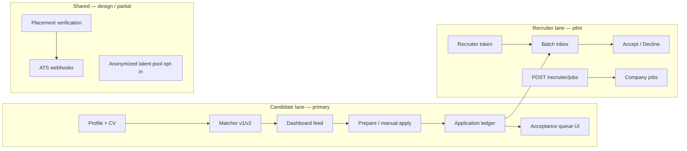

# TWIN Recruiter Alignment Product Audit — 2026-06-04

**Auditor:** TWIN Strategic Product Auditor (HRTech, AI governance, candidate/recruiter experience, compliance-by-design)  
**Branch:** `chore/s2-csp-burnin-readiness-2026-06-01`  
**Branch HEAD (audit start):** `0620b71`  
**Audit UTC:** `2026-06-05` (docs-only session)  
**Mode:** Read-only code/docs + local `pytest tests/test_csp_report*.py`  
**Hard bans honoured:** no deploy, CSP enforce, env, DB, migrations, Railway restart, scrape/apply, prod mutations, secrets, public GO, S2 PASS, delegated-live or KYC-live claims

**Preserved launch reality:** Public **NO-GO** · controlled pilot **GO** · investor demo **GO** · S2 burn-in **IN PROGRESS** (until `2026-06-05T14:18:33Z` rollup) · auto-apply **PAUSED** · delegated apply **NOT LIVE** · L6/O5 founder waivers signed `2026-06-03T13:19:53Z` · copy audit `2026-06-04` complete

---

## 1 — Executive summary

TWIN is architecturally and narratively **candidate-first** with **deliberate recruiter-supporting mechanics** (batch acceptance inbox, employer attestation, anonymized talent-pool opt-in, placement verification design). It is **not recruiter-hostile** in code or current copy: autonomous apply is **hard-gated and operationally paused**, and marketing/compare pages explicitly disclaim live delegated submit.

However, TWIN is **not a balanced two-sided marketplace (D)** today. Engineering depth, daily UX, and launch gates are **candidate-dashboard-centric**; recruiter tooling is **pilot-thin** (token-gated inbox, job POST API, ATS webhook scaffolding) while the **recruiter marketing SKU** (watchlists, HM packets, seat packs) is **mostly narrative** — not evidenced as shipped product surfaces beyond `/recruiter/inbox`, `/recruiter/jobs`, and marketing persona pages.

**Strategic verdict:** **C) candidate-first, recruiter-supporting** — with a **north-star intent toward D** that requires recruiter liquidity, explainability, SSO/employer accounts, and parity in roadmap investment before claiming “two-sided.”

**Top risks for recruiter trust:** (1) future auto-apply re-enable without recruiter-visible controls, (2) recruiter inbox exposes **candidate names** (PII) despite talent-pool anonymization elsewhere, (3) gap between **marketing recruiter SKU** and **live recruiter product**, (4) weak **match explainability** on recruiter-facing surfaces.

---

## 2 — Current verdict

| Option | Fit | Rationale |
| ------ | --- | --------- |
| **A) Candidate-first, recruiter-hostile** | ❌ Rejected | Auto-apply **PAUSED**; `delegated_apply_allowed=false`; compare/copy avoids “replace recruiters”; inbox framed as pre-qualified queue |
| **B) Candidate-first, recruiter-neutral** | ⚠️ Too weak | Shipped recruiter inbox + batch respond + employer attestation + pilot spam playbook go beyond neutral |
| **C) Candidate-first, recruiter-supporting** | ✅ **Current** | Acceptance workflow, placement verification design, rate limits, anonymized B2B pool opt-in — but thin vs vision |
| **D) Two-sided** | ❌ Not yet | Candidate loop dominates; recruiter seats invoice-only; no evidenced marketplace liquidity or balanced GTM |

**If not D — what must change (summary):**

1. **Product:** Recruiter-facing match explainability, score + consent receipts on inbox rows; optional anonymized candidate cards until accept; SSO/company accounts replacing token pilot.
2. **Operations:** Permanent auto-apply guardrails visible to employers (thresholds, board allowlists, pause hooks) before any re-enable.
3. **GTM:** Ship or de-scope recruiter marketing pillars (watchlists, HM packets) to avoid overpromise.
4. **Liquidity:** Two-sided calendar acceptance with real employer/partner cohort — not only candidate-initiated applications to scraped jobs.
5. **Compliance:** Recruiter DPA/B2B data-processing lane separate from consumer privacy page (partially in persona copy; not evidenced as live portal).

---

## 3 — Evidence findings (with file refs)

### North star includes recruiters

Project rules and dashboard copy define acceptance for **both** sides:

```413:413:frontend/src/lib/i18n.ts
      "Without TWIN you return from time off to a calendar of random interviews or an inbox of thousands of CVs. With TWIN you return to a short list of moments that matter: interviews worth taking, candidates you can accept in one tap. Not noise.",
```

```1567:1567:frontend/src/lib/i18n.ts
    lead: "Set your bar once. TWIN ranks roles while you are away, applies only where you agree, and puts interview slots on the calendar you already use. Recruiters see profiles already matched — accept, decline, or reschedule.",
```

### Delegated apply explicitly NOT LIVE

```251:275:backend/app/services/candidate_readiness.py
def compute_verified_candidate_gate(user: User, candidate: Candidate) -> VerifiedCandidateGateResult:
    """Read-only verified-candidate gateway state (no delegated submit)."""
    ...
    return VerifiedCandidateGateResult(
        ...
        delegated_apply_allowed=False,
        can_prepare_application_package=verification_status in _PREPARE_ALLOWED_STATUSES,
        can_submit_delegated_application=False,
    )
```

### Autonomous apply server gate (403)

```31:52:backend/app/services/autonomous_apply_policy.py
def enforce_autonomous_apply_allowed(
    user: User,
    candidate: Candidate | None,
    *,
    status_code: int = status.HTTP_403_FORBIDDEN,
) -> None:
    """Raise before any Playwright submit or nightly processing for this user."""
    ...
    if not autonomous_apply_allowed(user, candidate):
        raise HTTPException(
            status_code=status_code,
            detail=VERIFIED_READINESS_NOT_READY_DETAIL,
        )
```

Launch matrix confirms **PAUSED** ops stance: `docs/PUBLIC_LAUNCH_READINESS_MATRIX_2026-06-02.md` § F.

### Recruiter inbox — LIVE (pilot)

Backend batch acceptance:

```20:56:backend/app/services/recruiter_inbox.py
def build_recruiter_batch(
    db: Session,
    *,
    company_slug: str,
    limit: int = 25,
) -> dict:
    """Applications for jobs matching company slug — applied/interview only."""
    ...
                "candidate_name": (cand.name or "").strip() or "Candidate",
```

API routes: `backend/app/api/recruiter.py` — GET inbox, POST respond, POST respond-batch (rate-limited `60/minute`).

Frontend: `frontend/src/app/recruiter/inbox/recruiter-inbox-client.tsx` — batch select, accept/decline, filters.

Copy positions inbox as anti-spam:

```2034:2041:frontend/src/lib/i18n.ts
  recruiterInbox: {
    title: "Recruiter acceptance inbox",
    lead: "Pre-qualified applications for your company — accept for interview or decline without inbox noise.",
    ...
    emptyStateBody:
      "A short queue of candidates TWIN already matched to your roles. You accept who gets an interview slot or decline in one click — no CV spam, no email ping-pong.",
```

**PII policy (documented 2026-06-06):** Inbox = `application_review` — candidate **name OK** for employer reviewing an application. B2B talent pool = `talent_pool_anonymized` — no name/email/phone/CV text. See `docs/RECRUITER_DEMO_PATH_2026-06-06.md` § PII policy.

**Gap:** Inbox returns **candidate_name** — intentional for application review; differs from talent-pool anonymization elsewhere.

### Talent pool anonymization (candidate opt-in)

```1404:1419:frontend/src/lib/i18n.ts
    talentPoolOptIn: "Show my anonymized profile in the B2B talent pool",
    talentPoolOptInHint:
      "Recruiters may see skills, a validation badge, and a match score only. They never see your name, email, phone, CV text, or exact location.",
    ...
    talentPoolProcessingConsentHint:
      "Recruiters see only aggregated signals, not your name, email, phone, CV text, or exact address.",
```

**Not evidenced in repo:** End-to-end recruiter UI browsing anonymized talent pool (only opt-in copy + consent flags).

### Matching — rule-based, candidate-side

```35:45:backend/app/matching/matcher.py
def calculate_match_score(candidate: dict[str, Any], job: dict[str, Any]) -> float:
    """Score 0–100 from skills, salary, location, experience, and optional CV context."""
    score = 0.0
    score += _skills_score(candidate, job)
    ...
    return round(min(score, 100.0), 2)
```

Quality gate doc: `docs/MATCHING_QUALITY_GATE.md` — min_score 38 feed, top 20 highlight; **no recruiter explainability export**.

### Recruiter marketing SKU vs shipped product

Persona page promises sourcer watchlists, HM packets, governance — **marketing**:

```258:325:frontend/src/lib/persona-pages.ts
const recruitersEn: PersonaBundle = {
  heroTitle: "Evidence-first sourcing without candidate PII leaks",
  ...
  logistics: [
    "No bulk download of candidate CVs from TWIN consumer accounts; different legal basis.",
    "No promise of auto-apply into third-party ATS without integration work.",
    "Recruiter features roll out on a separate roadmap from the candidate mobile/web MVP.",
  ],
```

**Shipped recruiter routes (evidenced):** `/recruiter/inbox`, `/recruiter/jobs`, `/recruiter/integrations/ats`, `/workspace/recruiter`, marketing `/for-recruiters`.

### Compare / LinkedIn positioning

```2612:2626:frontend/src/lib/i18n.ts
  compare: {
    disclaimer:
      "Illustrative comparison only. Auto-apply and delegated submit are phased and paused on production today. ...",
    linkedinLead:
      "LinkedIn is the town square for careers. TWIN is the career twin for ranked matches and phased automation — prepare packages today; delegated apply is not live on production.",
    linkedinTwin2:
      "Phased auto-apply where boards and policy allow — prepare-only on production until delegated apply ships.",
```

### Static copy guards (CI)

`frontend/scripts/verified-readiness-guard.test.ts` forbids “Submit application”, “KYC verified”, “Guaranteed interview” on readiness card.

`frontend/scripts/dashboard-ux-safety.test.ts` — referenced in launch matrix § H (PASS 2026-06-02).

### Pilot recruiter spam playbook

```108:117:docs/CONTROLLED_PILOT_OPERATING_MANUAL_2026-05-27.md
### A recruiter (B2B pilot side) reports a spam-looking application

1. Pull the application's `match_score` and trail.
2. If `< 0.6`, the matching algorithm let the application
   through anyway — check the user's `min_score_threshold`
   on `AutoApplyConsent`. Threshold drift is a real failure
   mode of long-running pilots.
3. Tell the recruiter the score; either raise the user's
   threshold or auto-decline future applications below the
   recruiter's bar.
```

**Gap (resolved 2026-06-06):** Inbox API now returns `match_score`, `match_score_label`, `match_reasons[]`, **`review_card`**, `human_decision_required`, `pii_context`. See `backend/app/services/recruiter_match_explanations.py`, `docs/RECRUITER_TRUST_ROADMAP_2026-06-06.md`, and `docs/RECRUITER_DEMO_PATH_2026-06-06.md`.

### Placement verification — design, machine-assisted

`docs/PLACEMENT_VERIFICATION.md` — anti “CS tennis”; employer one-click attestation; ATS webhooks.

Employer attestation UI copy: `frontend/src/lib/i18n.ts` `placementEmployer.*`.

ATS inbound: `backend/app/api/integrations_ats.py` — webhook scaffolding (**best-effort** per file header).

### Tests (recruiter-related)

| Test file | Evidence |
| --------- | -------- |
| `backend/tests/test_recruiter_inbox.py` | Batch build + respond |
| `backend/tests/test_recruiter_company_auth.py` | Token mint/revoke |
| `backend/tests/test_consent_recruiter_rate_limits.py` | Inbox respond 429 |
| `backend/tests/test_candidate_verified_readiness_gate.py` | Gateway 11 passed |
| `backend/tests/test_autonomous_applying_readiness_gate.py` | Consent + 403 paths |

---

## 4 — Candidate value audit

| Dimension | Score (1–5) | Evidence | Gap |
| --------- | ----------- | -------- | --- |
| Ranked discovery | 4 | Matcher + dashboard top 200/20 (`MATCHING_QUALITY_GATE.md`) | Corpus scale below “marketplace” narrative |
| Application ledger | 4 | Applications panel, statuses, export | — |
| Calendar / acceptance queue | 3 | Google/Microsoft LIVE; Apple ICS partial (O5 waiver) | Symmetric “acceptance queue” candidate UI exists; recruiter-proposed slots **not fully evidenced** |
| Auto-apply / prepare | 3 | Prepare package gated; **PAUSED** on prod | “While you sleep” copy still prominent |
| Verified readiness | 4 | Gateway + dashboard card | KYC **not live** (by design) |
| Post-hire growth lane | 2 | Marketing `growthLane` in persona-pages | **Not evidenced** as dashboard features |
| Privacy / export | 4 | Export LIVE; delete manual (L6 waiver) | Self-service erasure missing |

**Candidate verdict:** Strong MVP for **controlled pilot**; north-star calendar narrative **partially** shipped.

---

## 5 — Recruiter value audit

| Dimension | Score (1–5) | Evidence | Gap |
| --------- | ----------- | -------- | --- |
| Inbox / batch decisions | 3 | LIVE token inbox | No match score, no explainability, **shows name** |
| Job posting | 2 | POST `/recruiter/jobs` | Not integrated with major board syndication |
| Sourcing / watchlists | 1 | Persona marketing only | **Not evidenced in app** |
| HM packets / export | 1 | Persona copy | **Not evidenced** |
| ATS integration | 2 | Webhook routes + UI panel | **Best-effort**; not production-verified in matrix |
| ROI / B2B calculator | 3 | Marketing calculator pages | Illustrative, not contractual |
| Spam prevention | 4 | Auto-apply PAUSED + gates | Future re-enable is recruiter risk |
| Employer attestation | 3 | Placement flow + copy | Pilot-scale; not mass-deployed |

**Recruiter verdict:** **Supportive intent, pilot-thin delivery** — inbox is real but not yet “recruiter product” parity with candidate dashboard.

---

## 6 — Business value audit

| Lane | Model (evidenced) | Recruiter alignment |
| ---- | ----------------- | ------------------- |
| Candidate Stripe | Premium/Pro self-serve | Indirect — better candidates if matching works |
| Recruiter seats | Invoice / contact (`persona-pages`) | **Sales-led**, not self-serve product loop |
| Company programs | Annual B2B (`for-companies`) | Placement verification + flat-rate calculator |
| Success fees | `PLACEMENT_VERIFICATION.md` design | Reduces “CS tennis” — **good for recruiters** if shipped |

**Business verdict:** Economics assume **verified placements**, not application volume — aligns with recruiter-friendly north star. **Tension:** candidate GTM (founding 1000, wishlist) runs ahead of recruiter seat revenue proof.

---

## 7 — Communication / copy audit

| Surface | Recruiter posture | Risk |
| ------- | ----------------- | ---- |
| Homepage `insideStep2Line` | “timeline recruiters can trust” | ✅ Supportive |
| Vacation story `vacationActivity3` | “recruiter thread worth a reply” | ✅ Supportive (storyboard) |
| `marketingHowItWorks.lead` | “Recruiters see profiles already matched” | ⚠️ Aspirational — inbox is pilot token |
| `home.insideTitle` / onboarding | “while you sleep” | ⚠️ Qualified in places; still candidate-dominant |
| Compare LinkedIn | Phased auto-apply, not hostile | ✅ Fixed 2026-06-04 |
| Recruiter persona | Separate SKU, no CV bulk download | ✅ Honest limits |
| Dashboard north star | Both-side acceptance | ✅ |

Copy audit reference: `docs/PUBLIC_LAUNCH_COPY_CLAIMS_AUDIT_2026-06-04.md` — **LOW** remaining risk; public launch still **NO-GO** for ops gates.

**Copy verdict:** **Recruiter-neutral-to-supportive** after June 2026 fixes; not hostile. Main gap: **marketing promises recruiter workflows** not yet in product.

---

## 8 — Feature / architecture audit



**Architecture alignment:** `.cursorrules` north star (matching → consent → ranked pipeline → acceptance UI → calendar) is **partially implemented** — candidate feed + ledger are strong; **recruiter acceptance** exists but **decoupled from calendar sync** on recruiter side (no evidenced recruiter calendar product).

**CTO audit delta (2026-05-26):** “architecture partially aligned (interviews, batch recruiter UX) but candidate experience still feed-centric” — still accurate.

---

## 9 — AI governance / compliance-by-design

| Control | Status | Recruiter relevance |
| ------- | ------ | ------------------- |
| GDPR signup consents (L1) | ✅ LIVE | Separate flags: job data, AI matching, CV processing |
| AI matching consent | ✅ Model + tests | Candidates opt in before matching |
| Auto-apply consent v1 | ✅ DB + API | Auditable; requires verified readiness |
| Cookie consent audit | ✅ | — |
| Verified gateway | ✅ Read-only | Blocks spam automation |
| AI Act / formal DPIA | **Not evidenced in repo** | Do not claim regulatory compliance beyond MVP privacy pages |
| LLM mutation rate limits | ✅ Layer 2 | Reduces abuse |
| Explainability of AI matching | **Weak** | Rule-based matcher + optional LLM enrichment — **no recruiter-facing model card** |

**Compliance verdict:** **Compliance-by-design for candidate consent and automation gates** — good recruiter-risk mitigation. **No** evidenced AI Act conformity assessment or recruiter-specific DPA portal.

---

## 10 — Human-in-the-loop audit

| Loop | Human | Automation | Recruiter impact |
| ---- | ----- | ---------- | ---------------- |
| Job discovery | Candidate browses / feedback | Scrape + rank | Indirect |
| Apply / prepare | Candidate triggers prepare | Playwright prepare (**gated**) | Fewer mystery submits while PAUSED |
| Nightly auto-apply | Consent + readiness | Celery (**PAUSED** prod) | Would be high risk if on |
| Recruiter decision | Accept / decline in inbox | None on submit | ✅ Explicit HITL |
| Placement verify | Candidate declare + employer attestation | Email magic link | ✅ Reduces ping-pong |
| Verified readiness | Checklist completion | Status machine | ✅ Before automation |

**HITL verdict:** **Strong for current PAUSED posture.** Weakest link: **future delegated apply** — requires recruiter-visible audit trail before enable.

---

## 11 — Product gaps (recruiter alignment)

| # | Gap | Severity | Evidenced |
| - | --- | -------- | --------- |
| G-R01 | Recruiter inbox shows **candidate_name** vs talent-pool anonymization | HIGH | `recruiter_inbox.py` |
| G-R02 | No **match_score / explain** on inbox rows | HIGH | **Resolved 2026-06-06** — inbox API + UI |
| G-R03 | Marketing recruiter SKU (watchlists, packets) **not shipped** | HIGH | `persona-pages.ts` vs routes |
| G-R04 | Token auth only — no employer SSO / RBAC | MEDIUM | `recruiter.py` header |
| G-R05 | Two-sided **calendar** (recruiter propose slot) not evidenced | MEDIUM | Candidate acceptance queue only |
| G-R06 | Talent pool browse for recruiters **not evidenced** | MEDIUM | Opt-in copy only |
| G-R07 | ATS webhooks **best-effort**, not launch-verified | MEDIUM | `integrations_ats.py` |
| G-R08 | Auto-apply re-enable playbook lacks **employer notification** product | HIGH | Pause plan docs only |
| G-R09 | LinkedIn / board ToS for automated apply | MEDIUM | `SCRAPING_COMPLIANCE.md` — policy not recruiter-facing |
| G-R10 | Self-service account delete (L6) | LOW for recruiter; MEDIUM for trust | Manual DSR |

---

## 12 — Roadmap (now / 0–30 / 30–60 / 60–90 / later)

| Horizon | Recruiter-alignment deliverables |
| ------- | -------------------------------- |
| **Now (pilot)** | Keep auto-apply **PAUSED**; demo inbox + jobs with honest copy; use pilot manual spam playbook |
| **0–30d** | ~~Add inbox row: `match_score`, top 3 match reasons~~ **Done 2026-06-06**; document token rotation |
| **0–30d** | Align inbox PII: anonymize until accept OR disclose in recruiter invite |
| **30–60d** | Ship minimal **recruiter match receipt** PDF/email on accept |
| **30–60d** | Close GAP-04 / auto-apply policy doc with **employer-facing** pause + threshold defaults |
| **60–90d** | Pilot **talent pool browse** (anonymized) for 3–5 B2B partners |
| **60–90d** | One ATS webhook **production-verified** (Greenhouse or Ashby) |
| **Later** | Employer SSO, recruiter calendar propose, two-sided liquidity metrics, AI governance pack for B2B |

---

## 13 — Launch implications

| Audience | Implication |
| -------- | ----------- |
| **Public launch NO-GO** | Unchanged — S2 primary; this audit does **not** unlock public GO |
| **Controlled pilot GO** | Safe to invite recruiters **by name** with token inbox + spam playbook; set expectations: pilot thin |
| **Investor demo GO** | Lead with **acceptance calendar north star** + show inbox; disclaim auto-apply **PAUSED** |
| **Recruiter sales** | Do **not** sell watchlists/HM packets as live; sell **inbox pilot + placement verification roadmap** |
| **LinkedIn / press** | Avoid “replace recruiters” or “apply while you sleep” without **paused/delegated** qualifiers |

Reference: `docs/LAUNCH_DAY_MONITORING_ROLLBACK_RUNBOOK_2026-06-04.md`

---

## 14 — Messaging recommendations

### Homepage

- Keep dual-audience block (`audienceRecruiterBody`) — strong.
- Soften unqualified “while you sleep” in hero; prefer **“when automation you enable is available”** (already in `insideTitle`).
- Add one line: **“Employers: pre-qualified queue, not CV firehose — pilot with us.”**

### Candidate

- Retain verified readiness + prepare-only honesty.
- Tie auto-apply to **consent + recruiter-quality bar** (“applications worth a recruiter’s accept click”).

### Recruiter

- Lead: **“Accept or decline in one batch — matched before they hit your inbox.”**
- Explicit: **token pilot today; SSO and anonymized pool on roadmap.**
- Do not claim HM packet generator until shipped.

### Business / procurement

- Lead with **placement verification** and **fee on verified hire**, not application volume.
- Point to B2B calculator as **illustrative** only.

### Taglines (safe)

- “**Calendar of acceptance — not inbox spam.**” (north star)
- “**Ranked for your bar. Accepted on your terms.**” (candidate)
- “**Pre-matched queue. One-click accept or pass.**” (recruiter pilot)

### Auto-apply wording (mandatory qualifiers)

- EN: “Phased prepare-only on production; delegated submit not live.”
- PL: “Na produkcji prepare-only; delegated submit wyłączony.”
- Never: “TWIN applies for you 24/7” without gates named.

---

## 15 — Risk matrix

| ID | Risk | L | I | Mitigation | Owner |
| -- | ---- | - | - | ---------- | ----- |
| RR-01 | Auto-apply re-enabled → employer spam | M | H | Keep PAUSED until employer playbook; min_score + daily cap | Founder |
| RR-02 | Inbox PII leak via token | M | M | Token rotation; anonymize rows | Eng |
| RR-03 | Marketing overpromise recruiter SKU | H | M | De-scope copy or ship watchlists MVP | Product |
| RR-04 | Recruiter trust loss from opaque matching | M | M | Match receipt on inbox row | Eng |
| RR-05 | Two-sided narrative before liquidity | H | L | Pilot-only recruiter claims | GTM |
| RR-06 | Board ToS violation on apply automation | M | H | Board allowlists; legal review | Legal/Founder |
| RR-07 | AI matching without explainability | M | M | Rule-based reasons export | Eng |
| RR-08 | L6 manual delete — enterprise objection | L | M | Roadmap self-service delete | Eng |

---

## 16 — Founder decision list

1. **Confirm verdict C** vs invest to **D** in next 90 days — yes/no and budget.
2. **Recruiter inbox PII:** anonymize by default until accept, or explicit pilot waiver?
3. **Marketing recruiter SKU:** strip unshipped pillars from `/for-recruiters` or fund 30-day watchlist MVP?
4. **Auto-apply:** require signed **employer notification** spec before any prod re-enable?
5. **Talent pool:** run 3-partner anonymized browse pilot before broad B2B claims?
6. **Public launch:** maintain **NO-GO** until S2 + recruiter messaging audit sign-off?
7. **L6/O5 waivers:** renew for next pilot cohort or prioritize self-service delete + Apple smoke?

---

## 17 — 30 / 60 / 90 action plan

### Days 0–30

- [x] Inbox API: add `match_score` + `match_reasons[]` (read-only). **2026-06-06**
- [x] Recruiter invite brief updated with PII policy (`CONTROLLED_PILOT_INVITE_BRIEF` + `LIMITED_RECRUITER_PILOT_PACK_2026-06-06.md`). **2026-06-06**
- [ ] Homepage recruiter CTA → `/for-recruiters` + `/contact` (verify links in smoke).
- [ ] Founder demo script: 2 min recruiter inbox path.

### Days 31–60

- [ ] Anonymized talent pool browse (partner-only flag).
- [ ] One ATS webhook verified end-to-end on staging.
- [ ] Auto-apply re-enable **design review** with recruiter advisory (docs only if no code).

### Days 61–90

- [ ] Recruiter SSO scoping doc + PRD.
- [ ] Match quality gate: recruiter-facing sample report from `matching-quality` admin endpoint.
- [ ] Re-run this audit; target **D** criteria scorecard.

---

## 18 — Do not claim list

- ❌ Public launch live / S2 PASS
- ❌ Delegated apply or KYC verification **live**
- ❌ “Auto-apply runs while you sleep” **on production today**
- ❌ Full Apple Calendar OAuth (ICS/WebCal only — O5 waiver)
- ❌ Self-service account delete (L6 manual)
- ❌ Recruiter watchlists, HM packets, governance presets as **shipped product** (marketing only)
- ❌ Two-sided marketplace / liquidity
- ❌ AI Act conformity or legal compliance beyond MVP privacy/terms
- ❌ Guaranteed interviews or employer-validated candidates
- ❌ “Replace LinkedIn / replace recruiters”

---

## 19 — Build next list (recruiter alignment priority)

1. **Inbox match receipt** — score + reasons on each row (backend + UI). **Shipped 2026-06-06**
2. **PII policy alignment** — anonymize inbox or document pilot exception.
3. **Recruiter demo seed** — stable inbox data (`investor_demo_seed.py` path exists).
4. **Talent pool recruiter browse** — minimal list API (anonymized).
5. **Employer attestation** — prod smoke in pilot runbook.
6. **ATS webhook** — one vendor production-verified.
7. **Auto-apply employer playbook** — doc + product hooks before re-enable.
8. **Recruiter SSO PRD** — replace token pilot.

---

## 20 — Final strategic recommendation

**Adopt verdict C (candidate-first, recruiter-supporting)** for all external comms until recruiter inbox + match transparency + at least one B2B partner loop prove repeatable value.

**Do not claim D (two-sided)** until:

- Recruiter daily active use is measurable in pilot tracker,
- Anonymized discovery or inbox covers **both** sides of acceptance calendar,
- Auto-apply remains off or employer-guarded with auditable thresholds.

**Strategic moat vs LinkedIn:** not breadth of network — **consent-first ranked pipeline toward acceptance-ready calendar items** with **machine-assisted placement verification** instead of CS tennis. That story is **credible in docs and partial code**; it becomes **investable** when recruiter inbox + match receipts + one verified placement fee close in pilot.

**Immediate founder action:** Use pilot GO to put **5 named recruiters** on token inbox with spam playbook; instrument accept/decline rates; defer public launch and recruiter SKU marketing scale until S2 closes and inbox transparency ships.

---

## Scoring framework — 12 dimensions (1–5)

| # | Dimension | Score | Why | +1 path | Best-in-class |
| - | --------- | ----- | --- | ------- | ------------- |
| 1 | Recruiter value delivery | **2** | Inbox + jobs only; SKU mostly marketing | Ship match receipt + 5 pilot recruiters | Greenhouse inbound quality |
| 2 | Candidate–recruiter fairness | **3** | Consent gates; inbox batch; but candidate-led scrape | Recruiter-proposed slots | Balanced marketplace policy |
| 3 | Copy / messaging alignment | **4** | June 2026 copy audit; dual-audience | De-scope unshipped recruiter pillars | Radical honesty + proof links |
| 4 | Auto-apply safety (recruiter impact) | **4** | PAUSED + hard gates | Employer-visible pause | Board-partner allowlists |
| 5 | Matching transparency | **3** | Scores on candidate UI + **recruiter inbox reasons** | Talent pool browse for recruiters | Explainable ranking API |
| 6 | Privacy / PII (recruiter-facing) | **3** | Talent pool anonymized; inbox names | Anonymize inbox | GDPR-minimized profiles |
| 7 | Human-in-the-loop | **4** | Accept/decline; consent; PAUSED apply | Recruiter threshold prefs | Mandatory review queues |
| 8 | Two-sided liquidity | **1** | Candidate-heavy corpus | B2B partner jobs in corpus | LinkedIn network effects |
| 9 | Recruiter tooling depth | **2** | Token inbox vs full ATS | SSO + job syndication | Full-cycle ATS |
| 10 | Compliance-by-design | **4** | Consent layers + rate limits | B2B DPA portal | Enterprise compliance suite |
| 11 | Placement verification | **3** | Strong design; pilot scale | Prod attestation smoke | Automated fee on verified hire |
| 12 | Integration / ATS readiness | **2** | Webhook scaffold | One verified vendor | Native ATS embed |

**Composite (simple average):** **2.8 / 5** — recruiter-supporting architecture, **not yet two-sided product-market fit**.

---

## LinkedIn / recruiter objections — address matrix

| Objection | Addressed? | Evidence | Missing |
| --------- | ---------- | -------- | ------- |
| “Auto-apply bots spam our jobs” | ✅ **Yes (today)** | PAUSED; `enforce_autonomous_apply_allowed`; copy disclaimers | Re-enable risk; employer notification product |
| “Unqualified flood of applicants” | ⚠️ **Partial** | Matcher thresholds; consent `min_score`; **inbox match_score + reasons (2026-06-06)** | Recruiter threshold prefs in product |
| “Candidates bypass recruiters” | ⚠️ **Partial** | TWIN is candidate-side; applies to **employer boards** | Partner model where recruiter is client |
| “Black-box AI matching” | ⚠️ **Partial** | Rule-based matcher + **inbox reason strings** | Recruiter model card / LLM disclosure |
| “GDPR / privacy violations” | ⚠️ **Partial** | Consent flags; talent pool anonymization copy | Inbox exposes names; no recruiter DPA portal evidenced |
| “Fake credentials / AI hallucination” | ⚠️ **Partial** | Verified gateway; no KYC live | Skill evidence not employer-verified |
| “No human recruiter in the loop” | ✅ **Yes (pilot inbox)** | Batch accept/decline | Auto-apply path when on bypasses employer until apply lands |
| “Replaces recruiters / disintermediation” | ✅ **Addressed in copy** | Compare pages; north star accept/decline | Founding marketing still candidate-hero heavy |
| “Can’t integrate with our ATS” | ⚠️ **Partial** | `integrations_ats.py`; recruiter ATS page | Production-verified webhook |
| “Low signal-to-noise vs LinkedIn” | ⚠️ **Partial** | Pre-qualified queue narrative | Liquidity not proven at scale |
| “Terms of service / scraping abuse” | ⚠️ **Partial** | `SCRAPING_COMPLIANCE.md`; ops allowlists | Recruiter-facing compliance one-pager |
| “Success fees / placement disputes” | ✅ **Design** | `PLACEMENT_VERIFICATION.md` | Not production-scale evidenced |

---

## Related docs

- `docs/PUBLIC_LAUNCH_READINESS_MATRIX_2026-06-02.md`
- `docs/PUBLIC_LAUNCH_GATE_CHECKLIST_2026-05-27.md`
- `docs/PRODUCTION_REALITY_MATRIX_2026-05-27.md`
- `docs/PUBLIC_LAUNCH_COPY_CLAIMS_AUDIT_2026-06-04.md`
- `docs/AUTO_APPLY_DELEGATED_APPLY_SAFETY_AUDIT_2026-06-02.md`
- `docs/TWIN_PRODUCT_NARRATIVE_2026-05-28.md`
- `docs/PLACEMENT_VERIFICATION.md`
- `docs/VERIFIED_CANDIDATE_GATEWAY_2026-05-28.md`

---

## Validation (session)

| Command | Result |
| ------- | ------ |
| `git diff --check` | Run at commit time |
| `pytest backend/tests/test_csp_report*.py -q` | Run at commit time |

## Hard bans honoured

- ✅ Docs only — no code, env, deploy, DB, migrations
- ✅ No scrape / apply / sweep · no S2 PASS · no public GO
- ✅ No delegated-live · no KYC-live claims · no broad legal conclusions without caveat
