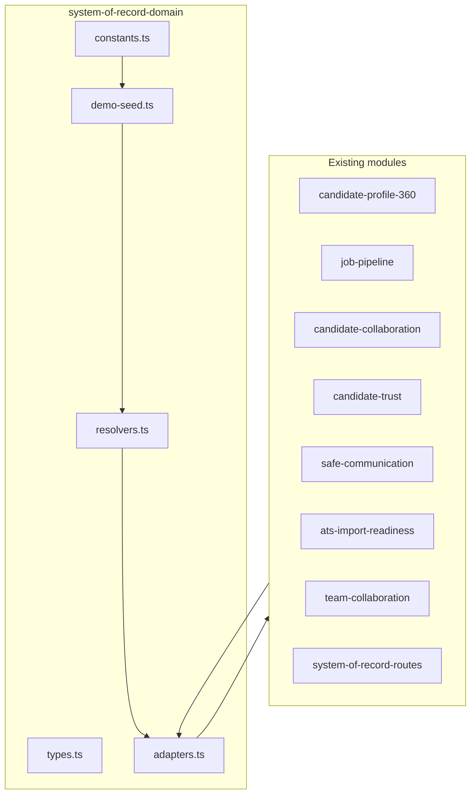

# TWIN System-of-Record Domain Kernel — 2026-06-17

## Mission

Introduce a **local domain kernel** for recruiter/company system-of-record modules: canonical types, unified demo seed, resolvers, and backward-compatible adapters — without risky rewrites of workspace pages or shell/gate/layout layers.

## Scope

- **In scope:** `frontend/src/lib/system-of-record-domain/`, demo ID alignment in `*-demo-data.ts`, static tests, docs.
- **Out of scope:** Backend APIs, live ATS sync, outbound communication, shell/gate/layout changes, decision-memory workspace UI (pages exist; component may be on separate branch).
- **Launch stance:** **NO-GO unchanged** — kernel is repo-only pilot infrastructure.

## Architecture



## Domain entities (`types.ts`)

| Type | Purpose |
|------|---------|
| `TwinCandidate` | Core candidate row (display name, fit, consent flags) |
| `TwinRole` | Job/role metadata |
| `TwinApplication` | Application context per candidate×role |
| `TwinMatch` | Match explanation + missing info |
| `TwinPipelineStage` / `TwinPipelineEntry` | Pipeline board positions |
| `TwinNote` / `TwinFeedback` / `TwinScorecard` | Collaboration artifacts |
| `TwinConsentRecord` / `TwinContactHistoryEvent` | Trust layer |
| `TwinTeamTask` | Team collaboration follow-ups |
| `TwinCommunicationDraft` | Safe communication drafts (no outbound) |
| `TwinAtsImportRecord` | ATS mapping pilot metadata |
| `TwinDecisionMemoryEvent` | Cross-module audit trail |
| `TwinEvidenceItem` | Profile evidence links |
| `TwinSystemOfRecordLink` | Navigation links per persona |
| `TwinModuleStatus` / `TwinBoundaryTag` / `TwinPersona` | Hub alignment types |

All types are strict TypeScript — **no `any`**, **no PII**, **no real emails**.

## Canonical IDs (`constants.ts`)

| Constant | Value |
|----------|-------|
| `TWIN_DEMO_CANDIDATE_PRIMARY_ID` | `demo-candidate-001` |
| `TWIN_DEMO_ROLE_PRIMARY_ID` | `demo-role-001` |
| `TWIN_DEMO_ATS_IMPORT_ID` | `lever-mapping-pilot` |
| `TWIN_DEMO_CANDIDATE_IDS` | `demo-candidate-001` … `demo-candidate-008` |

## Unified demo seed (`demo-seed.ts`)

- **8 candidates** on `demo-role-001` pipeline (internally consistent with `job-pipeline-demo-data.ts`).
- Primary row `demo-candidate-001` links to Profile 360, collaboration, trust, communication, ATS sample.
- Cross-module `decision_memory_events` reference `job_pipeline`, `safe_communication`, `candidate_collaboration`.

## Resolvers (`resolvers.ts`)

| Resolver | Returns `null` when |
|----------|---------------------|
| `resolveTwinCandidate(id)` | Unknown / empty ID |
| `resolveTwinRole(id)` | Not `demo-role-001` |
| `resolveCandidateProfile360(id)` | Not primary demo ID |
| `resolveJobPipeline(roleId)` | Not `demo-role-001` |
| `resolveCandidateCollaboration(c, r?)` | ID mismatch |
| `resolveCandidateTrust(c, r?)` | ID mismatch |
| `resolveSafeCommunication(c, r?)` | ID mismatch |
| `resolveAtsImportReadiness(importId)` | Unknown connector ID |
| `resolveDecisionMemory(c, r)` | Not primary pair |
| `resolveSystemOfRecordLinks(persona, ctx)` | Empty for candidate/investor |

**Never throws** for invalid IDs.

## Adapters (`adapters.ts`)

Thin delegation to existing `get*Demo()` functions — preserves workspace component contracts while kernel owns ID consistency.

## Module ID migration

These files now import canonical IDs from the kernel (directly or via profile/pipeline chain):

- `candidate-profile-360-demo-data.ts`
- `job-pipeline-demo-data.ts`
- `ats-import-readiness-demo-data.ts`
- `candidate-collaboration-demo-data.ts` (via chain)
- `candidate-trust-demo-data.ts`
- `safe-communication-demo-data.ts`
- `team-collaboration-demo-data.ts`

## Tests

| Script | Assertions |
|--------|------------|
| `npm run test:system-of-record-domain-kernel` | 17 |
| `npm run test:system-of-record-route-consistency` | 17 |

## Hard bans (preserved)

- No changes to `LightweightRouteShell`, `PersonaWorkspaceGate`, `WorkspaceLayout`, `WorkspaceRouteLayout`, dashboard layouts, route fallback.
- No commit/push/deploy in this local overnight slice.
- P0 performance **OPEN** — not marked DONE.
- Launch **NO-GO** unchanged.

## Suggested commit message (do not commit in this slice)

```
refactor(domain): add system-of-record domain kernel
```

## Polish report (20 sections)

See agent delivery report in chat — sections 1–20 per founder template.

## Related docs

- `frontend/src/lib/system-of-record-domain/README.md`
- `docs/PRODUCTION_REALITY_MATRIX_2026-05-27.md` (snapshot line)
- `docs/PUBLIC_LAUNCH_READINESS_MATRIX_2026-06-02.md` (snapshot line)
- `docs/FOUNDER_PREMIUM_PRODUCT_QA_CHECKLIST_2026-06-08.md` (kernel test row)
